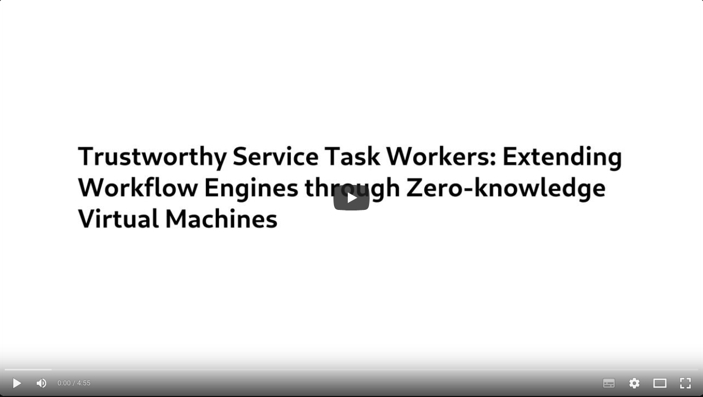
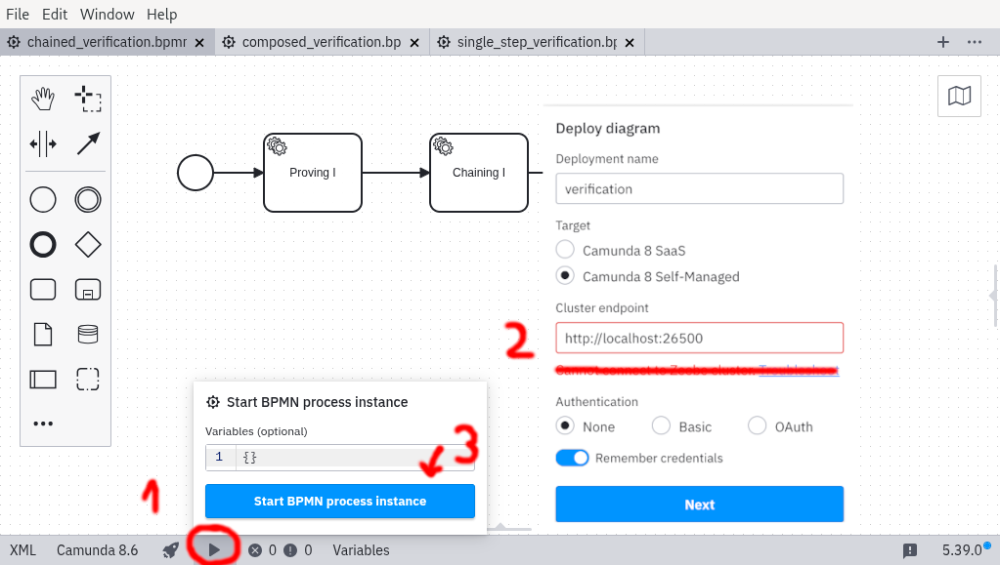

# Verifiable Computation in Business Processes

Ensuring integrity in inter-organizational business processes without exposing confidential data is a key challenge. 
We propose a zero-knowledge proof (ZKP)-based approach that enables verifiable yet confidentiality-preserving process execution. 
By integrating zero-knowledge virtual machines (zkVMs) into workflow management engines, our system allows organizations to prove the correctness of process outcomes without revealing internal computations. 
Using product carbon footprinting as a case study, we demonstrate how verifiable processes maintain trust and regulatory compliance while safeguarding sensitive business information. 
Evaluation results show that zkVM integration enables scalable, automated verification, albeit with notable proving overheads.

## Description

This project includes the implementation for the verifiable computing in business processes research paper.
It consists of:
- a Risc0 verifiable computing service written in Rust,
- a Zeebe workflow management ambassador written in Java,
- Camunda deployment files for running Camunda locally.

## Demo Video

[](https://www.youtube.com/watch?v=4yg6ovZEQjc)


## Installation

### Using the demo on Docker Compose: 
To install this project, follow these steps:

1. Clone the repository:
   ```bash
   git clone git@github.com:curiousjaki/verifiable-processes-demo.git
   cd verifiable-processes-demo
   ```

2. Run the Camunda Platform within Docker:
   ```bash
   docker compose -p zkvm4bpm down # If environment exist from previous demo
   docker compose \
      -p zkvm4bpm \
      -f docker-compose/docker-compose.yaml \
      --env-file ./docker-compose/.env \
      up -d --pull always 
   ```

3. Check if the docker environment is running as expected
   ```bash
   docker ps --format "table {{.Image}}\t{{.Names}}\t{{.Status}}"
   ```

4. Download and start the Camunda Modeler
   ```bash
   #MacOS arm64
   CAMUNDA_URL=https://downloads.camunda.cloud/release/camunda-modeler/5.39.0/camunda-modeler-5.39.0-mac-arm64.zip
   #Linux x86
   CAMUNDA_URL=https://downloads.camunda.cloud/release/camunda-modeler/5.39.0/camunda-modeler-5.39.0-linux-x64.tar.gz

   #Download the zip archive and extract it
   wget -qO- $CAMUNDA_URL | tar -xzf -

   camunda-modeler*/camunda-modeler &
   ```


5. Deploy the Business Process:
   - Navigate to the `examples` directory and run the business process from the Camunda Modeler on the local Docker installation

   1. Start the BPMN process instance by pressing the little arrow button in the bottom.
   2. Configure the modeler to connect to the local Camunda Platform on localhost:26500, leave authentication at one.
   3. Confirm the process instance start instruction

   

## Usage

1. Access the Camunda platform at `http://localhost:8081`. Username is `demo`, password is `demo`.
2. Deploy your BPMN workflows using the Camunda Modeler.
3. Observe the process execution through Camunda Operate


## Development


### Running on bare metal:

*Prerequisites:* Before you begin, ensure you have the following installed:
- Docker and Docker Compose
- cargo-risczero @ 2.3.1, cpp @ 2024.1.5, r0vm @ 2.3.1, rust @ 1.88.0

Then follow the Readme intructions of the individual repositories

Contributions are welcome! To contribute:
1. Fork the repository.
2. Create a new branch for your feature or bug fix.
3. Commit your changes and open a pull request.

## License

This project is licensed under the MIT License. See the `LICENSE` file for details.